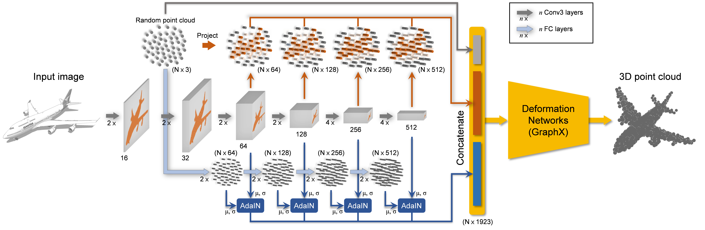
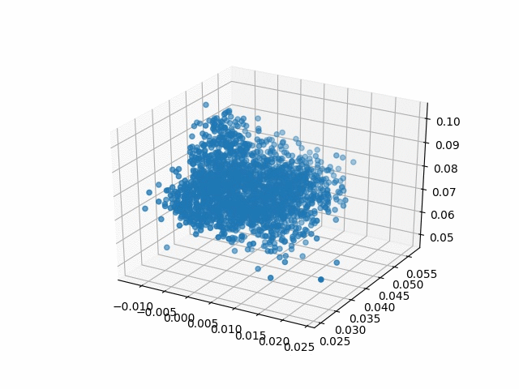
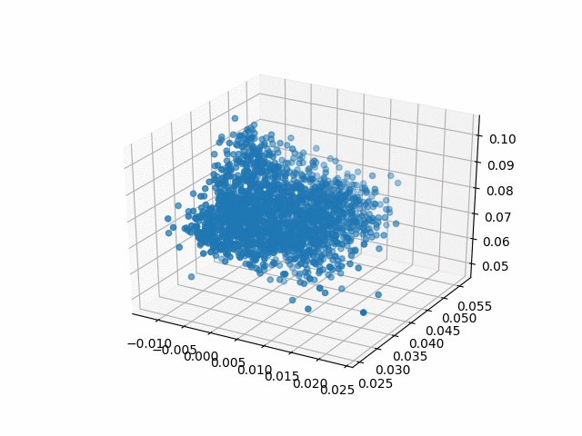

# GraphX-Convolution

The official implementation of the ICCV 2019 paper 
"GraphX-convolution for point cloud deformation in 2D-to-3D conversion".



__Updates:__ We have achieved a better performance with `PointCloudResLowRankGraphXUpDecoder`, 
which is an upgraded version of the best deformation network in the paper. The new network works 
comparably with the best network in the paper but consumes much less memory.

## Prerequisite

[Pytorch](https://pytorch.org/get-started/locally/) (>=1.0.0)

[Neuralnet-pytorch](https://github.com/justanhduc/neuralnet-pytorch) 
(branch [fancy](https://github.com/justanhduc/neuralnet-pytorch/tree/fancy))

[Gin-config](https://github.com/google/gin-config)

[Matplotlib](https://matplotlib.org/)

[TensorboardX](https://github.com/lanpa/tensorboardX)

The code has been tested on a Linux Ubuntu 16.04 machine.

## Data

The data we used in our experiment provided by [ShapeNet](https://www.shapenet.org/). 
However, for convenience, we used the pre-processed data provided by Pixel2mesh. 
The data can be downloaded from [here](https://github.com/nywang16/Pixel2Mesh).

The train/test split used in the paper is the default split provided by ShapeNet. 
For more convenience, we provide the pre-processed train/test file lists in [data](./data).

To process the data into the format used by the code, execute 

```
cd data
python split.py path/to/the/downloaded/data/folder
```

## Training and testing

### Training

After the database is setup, we are ready to train the model. 
In the [configs](./src/configs) folder, we have prepared the basic training configs for several models
used in the paper.
After the data is downloaded, specify the data root in these config files.

By default, the script creates a `results` folder containing checkpoint folders 
corresponding to the model name.
The model name can be specified in the config files.

Then, simply execute

```
cd src
python train.py path/to/a/config/file (--gpu 0)
```

To resume a half-done training, simply specify the checkpoint folder in the config file.
Then run the training script as in the training step.

### Evaluation

Be sure to use the same config file and specify the checkpoint folder in the config file.
After the model is fully trained, to test the model, use

```
python test.py path/to/a/config/file (--gpu 0)
```

The script calculates the Chamfer distance (CD) scores similar to 
[Pixel2mesh](https://github.com/nywang16/Pixel2Mesh).

## Results

### Visualizations

<p align='center'>
  
  
  
</p>

<p align='center'>
  
  
  
</p>

### Numerical results

|Methods|IoU|Chamfer|
|:-------:|:---:|:-------:|
|[3D-R2N2](http://3d-r2n2.stanford.edu/)|1.445|0.631|
|[PSG](https://arxiv.org/abs/1612.00603)|0.593|0.640|
|[Pixel2mesh](https://github.com/nywang16/Pixel2Mesh)|0.591|-|
|[GAL](https://link.springer.com/chapter/10.1007/978-3-030-01237-3_49)|-|0.712|
|Ours (UpResGraphX)|__0.252__|__0.725__|

## Citation

TBA
